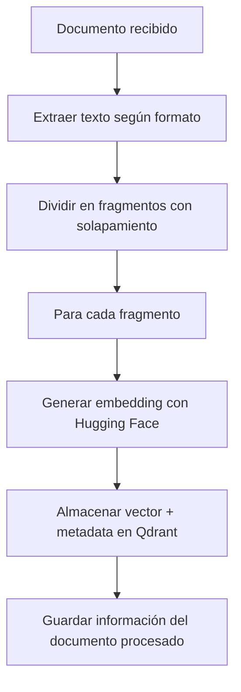
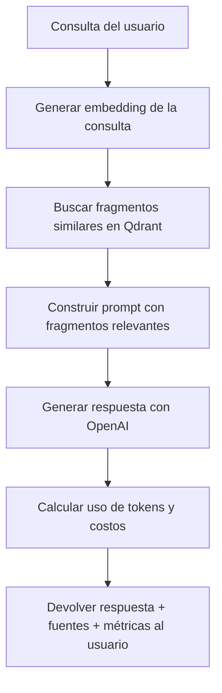

# Guía Técnica - Sistema RAG con Embeddings

Esta guía técnica detalla la arquitectura, implementación y componentes principales del sistema RAG con embeddings y bases de datos vectoriales.

## Índice

- [Arquitectura del Sistema](#arquitectura-del-sistema)
- [Componentes Principales](#componentes-principales)
- [Flujo de Datos](#flujo-de-datos)
- [Especificación de API](#especificación-de-api)
- [Monitoreo de Tokens y Costos](#monitoreo-de-tokens-y-costos)
- [Configuración Avanzada](#configuración-avanzada)
- [Solución de Problemas Técnicos](#solución-de-problemas-técnicos)
- [Optimizaciones y Rendimiento](#optimizaciones-y-rendimiento)

## Arquitectura del Sistema

El sistema implementa una arquitectura modular con los siguientes componentes interconectados:

```
┌────────────────┐     ┌─────────────────┐     ┌──────────────┐
│  Procesamiento │     │  Generación de  │     │  Base datos  │
│  de documentos ├────►│    embeddings   ├────►│  vectorial   │
└────────────────┘     └─────────────────┘     └──────┬───────┘
                                                      │
                                                      ▼
┌────────────────┐     ┌─────────────────┐     ┌──────────────┐
│  Generación de │     │   Búsqueda de   │     │  Procesador  │
│   respuestas   │◄────┤  fragmentos     │◄────┤  de consultas│
└───────┬────────┘     └─────────────────┘     └──────────────┘
        │
        ▼
┌────────────────┐
│ Métricas de uso│
│   y costos     │
└────────────────┘
```

### Tecnologías implementadas

- **Backend**: Node.js con Express
- **Embeddings**: Hugging Face Transformers (@xenova/transformers)
- **Base de datos vectorial**: Qdrant
- **Generación de respuestas**: OpenAI API (gpt-4o-mini)
- **Containerización**: Docker y Docker Compose
- **Interfaz de usuario**: HTML, CSS y JavaScript

## Componentes Principales

### 1. Procesamiento de Documentos (`documentService.js`)

Responsable de extraer texto, fragmentarlo y coordinar la generación de embeddings:

```javascript
// Extracto clave del servicio de documentos
async function processDocument(filePath, documentId, title) {
  // Extraer texto según formato del documento
  const fileExtension = path.extname(filePath).toLowerCase();
  let documentText = '';
  
  if (fileExtension === '.pdf') {
    const dataBuffer = await fs.readFile(filePath);
    const pdfData = await pdfParse(dataBuffer);
    documentText = pdfData.text;
  } else if (fileExtension === '.txt' || fileExtension === '.md' || fileExtension === '.json') {
    documentText = await fs.readFile(filePath, 'utf8');
  } else {
    throw new Error(`Formato no soportado: ${fileExtension}`);
  }
  
  // Dividir el texto en fragmentos
  const chunks = textSplitter.splitTextIntoChunks(documentText);
  
  // Generar embeddings para cada fragmento
  for (let i = 0; i < chunks.length; i++) {
    const embedding = await huggingfaceService.generateEmbedding(chunks[i]);
    
    // Almacenar embedding en Qdrant
    await qdrantService.insertEmbedding(embedding, {
      document_id: documentId,
      chunk_index: i,
      text: chunks[i],
      title: title
    });
  }
  
  // Guardar metadatos del documento
  return {
    id: documentId,
    title: title,
    totalChunks: chunks.length,
    // ...otros metadatos
  };
}
```

### 2. Generación de Embeddings (`huggingfaceService.js`)

Maneja la generación de vectores utilizando modelos de Hugging Face:

```javascript
// Importación dinámica para módulos ESM
async function importDependencies() {
  if (!pipelineModule) {
    const { pipeline } = await import('@xenova/transformers');
    pipelineModule = pipeline;
  }
  return pipelineModule;
}

// Generación de embeddings
async function generateEmbedding(text) {
  // Inicializar el modelo si no existe
  if (!embeddingModel) {
    await initializeEmbeddingModel();
  }

  // Generar el embedding
  const result = await embeddingModel(text, {
    pooling: 'mean',
    normalize: true
  });

  // Convertir a array JavaScript estándar
  return Array.from(result.data);
}
```

### 3. Generación de Respuestas con Tracking de Tokens (`openaiService.js`)

Gestiona la generación de respuestas y el seguimiento de uso de tokens:

```javascript
async function generateChatResponse(question, relevantChunks, conversationHistory = null) {
  // Construir el prompt con los fragmentos relevantes
  const contextText = relevantChunks.join('\n\n');
  
  // Preparar los mensajes
  const messages = [];
  
  // Añadir historial si existe
  if (conversationHistory && conversationHistory.messages && conversationHistory.messages.length > 0) {
    messages.push(...conversationHistory.messages);
  }
  
  // Añadir contexto y pregunta
  messages.push({
    role: "user",
    content: `Usando la siguiente información del documento, responde la pregunta:
    
Información del documento:
${contextText}

Pregunta: ${question}

Si la información proporcionada no es suficiente, indícalo.`
  });
  
  // Generar respuesta
  const response = await openai.chat.completions.create({
    model: process.env.OPENAI_COMPLETION_MODEL || "gpt-4o-mini",
    messages: messages,
    temperature: 0.3,
    max_tokens: 1000
  });
  
  // Extraer información de uso de tokens
  const tokenUsage = {
    prompt_tokens: response.usage.prompt_tokens,
    completion_tokens: response.usage.completion_tokens,
    total_tokens: response.usage.total_tokens,
    estimated_cost: calculateEstimatedCost(
      response.usage.prompt_tokens, 
      response.usage.completion_tokens,
      process.env.OPENAI_COMPLETION_MODEL || "gpt-4o-mini"
    )
  };
  
  return {
    content: response.choices[0].message.content,
    tokenUsage: tokenUsage
  };
}
```

### 4. Calculadora de Costos (`calculateEstimatedCost` en `openaiService.js`)

Estima el costo en USD basado en el uso de tokens y el modelo:

```javascript
function calculateEstimatedCost(promptTokens, completionTokens, model) {
  // Precios por 1000 tokens según OpenAI
  const pricing = {
    "gpt-4o-mini": {
      prompt: 0.00015,    // $0.15 por 1000 tokens de prompt
      completion: 0.00060  // $0.60 por 1000 tokens de completion
    },
    "gpt-4o": {
      prompt: 0.00050,    // $0.50 por 1000 tokens de prompt
      completion: 0.00150  // $1.50 por 1000 tokens de completion
    },
    "gpt-4": {
      prompt: 0.00030,    // $0.30 por 1000 tokens de prompt
      completion: 0.00060  // $0.60 por 1000 tokens de completion
    },
    "gpt-3.5-turbo": {
      prompt: 0.00010,    // $0.10 por 1000 tokens de prompt
      completion: 0.00020  // $0.20 por 1000 tokens de completion
    }
  };
  
  // Usar fallback si el modelo no está en la lista
  const modelPricing = pricing[model] || pricing["gpt-4o-mini"];
  
  // Calcular costo
  const promptCost = (promptTokens / 1000) * modelPricing.prompt;
  const completionCost = (completionTokens / 1000) * modelPricing.completion;
  const totalCost = promptCost + completionCost;
  
  return {
    usd: totalCost.toFixed(6),
    model: model,
    breakdown: {
      prompt_cost: promptCost.toFixed(6),
      completion_cost: completionCost.toFixed(6)
    }
  };
}
```

## Flujo de Datos

### 1. Procesamiento de Documentos



### 2. Procesamiento de Consultas con Tracking de Tokens



## Monitoreo de Tokens y Costos

### Implementación del Monitoreo de Tokens

El sistema implementa un seguimiento detallado del uso de recursos de OpenAI:

1. **Captura de métricas**: La respuesta de OpenAI incluye información detallada sobre tokens utilizados:
   ```javascript
   const tokenUsage = {
     prompt_tokens: response.usage.prompt_tokens,    // Tokens usados en el prompt
     completion_tokens: response.usage.completion_tokens,  // Tokens generados
     total_tokens: response.usage.total_tokens       // Total de tokens
   };
   ```

2. **Estimación de costos**: Calculamos el costo aproximado según las tarifas actuales:
   ```javascript
   const estimatedCost = calculateEstimatedCost(
     promptTokens, 
     completionTokens,
     modelName
   );
   ```

3. **Visualización en la interfaz**: La información se muestra al usuario de forma amigable:
   ```javascript
   // Implementación en el frontend
   const tokenInfoHTML = `
     <div class="token-info">
       <button class="toggle-tokens">Ver uso de tokens</button>
       <div class="tokens-details" style="display: none;">
         <h4>Uso de tokens:</h4>
         <ul>
           <li>Prompt: ${tokenUsage.prompt_tokens} tokens</li>
           <li>Respuesta: ${tokenUsage.completion_tokens} tokens</li>
           <li>Total: ${tokenUsage.total_tokens} tokens</li>
           <li>Costo estimado: $${tokenUsage.estimated_cost.usd} USD</li>
         </ul>
       </div>
     </div>
   `;
   ```

### Actualización de Precios

Para mantener la precisión en la estimación de costos, la función `calculateEstimatedCost` debe actualizarse cuando OpenAI modifique sus tarifas. Los precios actuales están definidos en:

```javascript
const pricing = {
  "gpt-4o-mini": {
    prompt: 0.00015,    // $0.15 por 1000 tokens de prompt
    completion: 0.00060  // $0.60 por 1000 tokens de completion
  },
  // Otros modelos...
};
```

## Especificación de API

### Endpoints de Documentos

#### `POST /api/documents/upload`

Sube y procesa un documento.

**Parámetros:**
- `file` (Form-data): Archivo a procesar (PDF, TXT, MD, JSON)
- `title` (Form-data): Título descriptivo

**Respuesta:**
```json
{
  "message": "Documento procesado con éxito",
  "document": {
    "id": "d290f1ee-6c54-4b01-90e6-d701748f0851",
    "title": "Manual Técnico",
    "filename": "manual.pdf",
    "totalChunks": 42,
    "processedAt": "2025-03-09T16:45:30.123Z"
  }
}
```

#### `GET /api/documents`

Obtiene la lista de documentos procesados.

**Respuesta:**
```json
[
  {
    "id": "d290f1ee-6c54-4b01-90e6-d701748f0851",
    "title": "Manual Técnico",
    "filename": "manual.pdf",
    "totalChunks": 42,
    "processedAt": "2025-03-09T16:45:30.123Z"
  },
  // Otros documentos...
]
```

### Endpoints de Consultas

#### `POST /api/queries`

Procesa una consulta y genera una respuesta con información de tokens.

**Cuerpo:**
```json
{
  "query": "¿Cómo configurar el sistema?",
  "options": {
    "limit": 5
  }
}
```

**Respuesta:**
```json
{
  "query": "¿Cómo configurar el sistema?",
  "answer": "Para configurar el sistema, debe seguir estos pasos: ...",
  "relevantChunks": [
    {
      "score": 0.89,
      "documentId": "d290f1ee-6c54-4b01-90e6-d701748f0851",
      "chunkIndex": 12,
      "text": "La configuración del sistema se realiza a través...",
      "title": "Manual Técnico"
    }
  ],
  "tokenUsage": {
    "prompt_tokens": 520,
    "completion_tokens": 85,
    "total_tokens": 605,
    "estimated_cost": {
      "usd": "0.000078",
      "model": "gpt-4o-mini",
      "breakdown": {
        "prompt_cost": "0.000051",
        "completion_cost": "0.000027"
      }
    }
  },
  "timestamp": "2025-03-09T18:22:15.456Z"
}
```

## Configuración Avanzada

### Modelos de Embedding

El sistema admite diferentes modelos de Hugging Face:

| Modelo                                       | Dimensiones | Rendimiento                | Uso recomendado                |
| -------------------------------------------- | ----------- | -------------------------- | ------------------------------ |
| Xenova/all-MiniLM-L6-v2                      | 384         | Rápido, equilibrado        | Uso general (predeterminado)   |
| sentence-transformers/all-mpnet-base-v2      | 768         | Mayor precisión, más lento | Cuando la precisión es crítica |
| Xenova/paraphrase-multilingual-MiniLM-L12-v2 | 384         | Soporte multilingüe        | Documentos en varios idiomas   |

### Configuración de Modelos de OpenAI

Para ajustar el modelo utilizado y sus costos asociados:

```
# En .env
OPENAI_COMPLETION_MODEL=gpt-4o-mini  # Modelo más económico
```

Modelos disponibles y sus características:

| Modelo        | Fortalezas        | Consideraciones                       | Costo relativo |
| ------------- | ----------------- | ------------------------------------- | -------------- |
| gpt-4o-mini   | Rápido, económico | Menos preciso que modelos más grandes | $              |
| gpt-4o        | Gran equilibrio   | Buena precisión, costo moderado       | $$$            |
| gpt-4         | Alta precisión    | Más costoso                           | $$             |
| gpt-3.5-turbo | Muy económico     | Precisión limitada                    | $              |

## Solución de Problemas Técnicos

### 1. Error "ERR_REQUIRE_ESM"

**Problema**: La biblioteca `@xenova/transformers` es un módulo ESM que no puede importarse con `require()`.

**Solución**: Usar importación dinámica:

```javascript
// En lugar de:
const { pipeline } = require('@xenova/transformers');

// Correcto - Importación dinámica
const { pipeline } = await import('@xenova/transformers');
```

### 2. Errores en cálculo de costos

**Problema**: Estimaciones de costo incorrectas debido a cambios en las tarifas.

**Solución**: Actualizar la tabla de precios en `calculateEstimatedCost`:

```javascript
const pricing = {
  "gpt-4o-mini": {
    prompt: 0.00015,    // Actualizar según tarifas vigentes
    completion: 0.00060
  },
  // Otros modelos...
};
```

## Optimizaciones y Rendimiento

### Optimización de Costos de OpenAI

1. **Ajuste de límite de fragmentos**:
   ```javascript
   // Reducir el número de fragmentos recuperados
   const limit = options.limit || 3; // Valor predeterminado más bajo
   ```

2. **Uso condicional de modelos**:
   ```javascript
   // Seleccionar modelo según complejidad
   const model = query.length > 100 ? "gpt-4" : "gpt-3.5-turbo";
   ```

3. **Control de tokens máximos**:
   ```javascript
   // Limitar la longitud de respuesta
   max_tokens: 500, // Valor más bajo para respuestas concisas
   ```

4. **Truncado inteligente de contexto**:
   ```javascript
   // Limitar el contexto enviado a OpenAI
   const truncatedChunks = relevantChunks.map(chunk => 
     chunk.length > 500 ? chunk.substring(0, 500) + "..." : chunk
   );
   ```

---

Esta guía técnica proporciona una visión completa de la implementación del sistema RAG con la nueva funcionalidad de monitoreo de tokens y costos. Para más información sobre conceptos o uso, consulte la [Explicación Conceptual](RAG-Concepto-Explicacion.md) o el [Manual de Usuario](Manual-Usuario.md).

---

Desarrollado por [Daniel Rosell](https://github.com/drosell271)