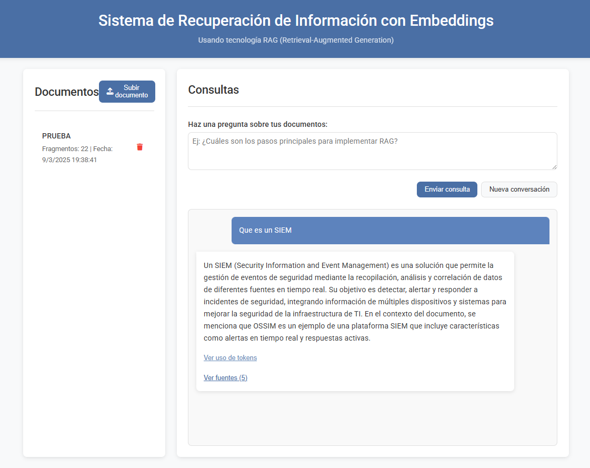
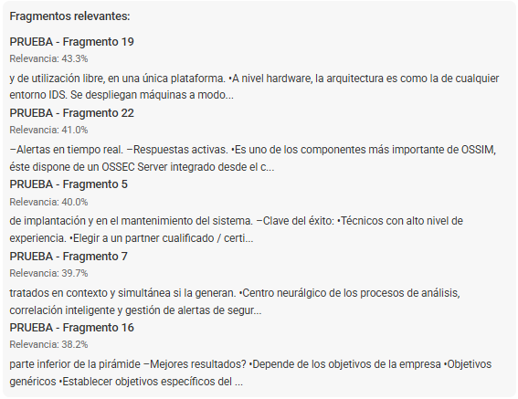
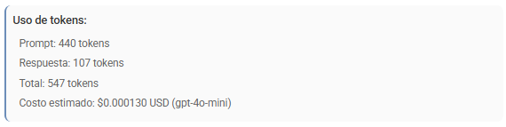

# Manual de Usuario - Sistema RAG con Embeddings

Este manual explica cómo utilizar el Sistema RAG (Retrieval-Augmented Generation) para consultar información de tus documentos mediante inteligencia artificial.

## Índice

- [Introducción](#introducción)
- [Interfaz de Usuario](#interfaz-de-usuario)
- [Gestión de Documentos](#gestión-de-documentos)
- [Consultas y Conversaciones](#consultas-y-conversaciones)
- [Monitoreo de Costos](#monitoreo-de-costos)
- [Buenas Prácticas](#buenas-prácticas)
- [Casos de Uso Prácticos](#casos-de-uso-prácticos)
- [Solución de Problemas](#solución-de-problemas)

## Introducción

El Sistema RAG te permite:

1. **Subir documentos** en diferentes formatos (PDF, TXT, JSON, MD)
2. **Realizar preguntas** sobre el contenido de estos documentos
3. **Obtener respuestas precisas** generadas por IA con referencias a las fuentes originales
4. **Monitorear el uso de recursos** con información detallada de tokens y costos
5. **Mantener conversaciones** con contexto sobre tus documentos

A diferencia de un buscador tradicional, este sistema entiende el significado semántico de tus consultas y no sólo busca coincidencias de palabras clave.

## Interfaz de Usuario

La interfaz está dividida en dos secciones principales:

1. **Panel de Documentos** (lado izquierdo):
   - Lista de documentos procesados
   - Botón para subir nuevos documentos
   - Opciones para eliminar documentos

2. **Panel de Consultas** (lado derecho):
   - Campo de texto para escribir preguntas
   - Historial de conversación
   - Botón para iniciar una nueva conversación

## Gestión de Documentos

### Subir un Documento

1. Haz clic en el botón **"Subir documento"** en la parte superior del panel izquierdo
2. En el formulario que aparece:
   - **Título**: Introduce un nombre descriptivo para el documento
   - **Archivo**: Selecciona un archivo desde tu dispositivo (formatos soportados: PDF, TXT, MD, JSON)
3. Haz clic en **"Procesar documento"**
4. Espera a que se complete el procesamiento (el tiempo varía según el tamaño del documento)

> **Nota**: El procesamiento implica dividir el documento en fragmentos, generar representaciones vectoriales y almacenarlas para consultas rápidas.

### Gestionar Documentos Existentes

- **Ver lista de documentos**: Los documentos procesados aparecen en el panel izquierdo con su título, fecha de procesamiento y número de fragmentos
- **Eliminar un documento**: Haz clic en el icono de papelera 🗑️ junto al documento que deseas eliminar

> **Atención**: La eliminación es permanente y no se puede deshacer. Todos los embeddings y metadatos asociados serán eliminados.

## Consultas y Conversaciones

### Realizar una Consulta

1. Escribe tu pregunta en el campo de texto del panel derecho
   - Formula preguntas claras y específicas
   - Puedes usar lenguaje natural conversacional
2. Presiona **"Enviar consulta"** o la tecla Enter
3. El sistema:
   - Analiza semánticamente tu pregunta
   - Busca fragmentos relevantes en tus documentos
   - Genera una respuesta basada en esos fragmentos

### Verificar Fuentes

Cada respuesta incluye un botón **"Ver fuentes"** que muestra:
- Los fragmentos originales utilizados para generar la respuesta
- El título del documento fuente
- La puntuación de relevancia (qué tan relacionado está cada fragmento con tu consulta)

Esto te permite verificar la precisión de la información y profundizar en el contexto original.

## Monitoreo de Costos

### Consultar Uso de Tokens

Cada respuesta generada incluye un botón **"Ver uso de tokens"** que muestra información detallada sobre:

1. **Tokens de prompt**: Cantidad de tokens utilizados para enviar tu consulta y el contexto a OpenAI
2. **Tokens de respuesta**: Cantidad de tokens generados en la respuesta
3. **Total de tokens**: Suma total de tokens utilizados en la operación
4. **Costo estimado**: Cálculo aproximado del costo en USD según las tarifas actuales de OpenAI
5. **Modelo utilizado**: El modelo de OpenAI empleado para generar la respuesta

Esta información te permite:
- Monitorear el consumo de recursos
- Optimizar tus consultas para reducir costos
- Planificar el presupuesto para el uso del sistema

> **Nota**: Los costos mostrados son estimaciones basadas en las tarifas públicas de OpenAI y pueden variar.

### Conversaciones con Contexto

El sistema mantiene el contexto de la conversación, permitiéndote hacer preguntas de seguimiento:

1. Primera pregunta: *"¿Cuáles son los requisitos del sistema?"*
2. Pregunta de seguimiento: *"¿Y cuáles son los opcionales?"*

El sistema entenderá que "opcionales" se refiere a "requisitos opcionales del sistema" gracias al contexto de la conversación.

### Iniciar una Nueva Conversación

Para iniciar un nuevo tema o consulta:

1. Haz clic en el botón **"Nueva conversación"**
2. Esto limpiará el historial de conversación actual
3. Comienza una nueva consulta sobre cualquier tema

## Buenas Prácticas

### Para Obtener Mejores Resultados:

1. **Documentos bien estructurados**:
   - Documentos con títulos, secciones y párrafos claros producen mejores resultados
   - El texto extraíble (no imágenes de texto) es esencial para el procesamiento

2. **Consultas efectivas**:
   - Sé específico en tus preguntas
   - Menciona términos clave que probablemente aparezcan en los documentos
   - Para preguntas complejas, divide en consultas más simples

3. **Optimización de costos**:
   - Preguntas concisas y directas generalmente consumen menos tokens
   - Revisa el uso de tokens para identificar patrones de consumo
   - Considera ajustar el modelo en la configuración para equilibrar calidad y costo

### Optimización por Tipo de Documento:

- **Documentos técnicos**: Preguntas precisas con terminología específica
- **Documentos legales**: Consultas que mencionen términos, cláusulas o secciones específicas
- **Contenido narrativo**: Preguntas sobre temas, personajes o eventos específicos

## Casos de Uso Prácticos

### 1. Consulta de Manuales Técnicos

**Ejemplo**: *"¿Cuáles son los pasos para resetear la configuración según el manual?"*

Este caso permite extraer procedimientos específicos de documentación extensa, ahorrando tiempo de búsqueda.

### 2. Análisis de Contratos

**Ejemplo**: *"¿Qué menciona el contrato sobre las penalizaciones por retraso en entregas?"*

Ideal para encontrar cláusulas específicas en documentos legales extensos.

### 3. Investigación de Informes

**Ejemplo**: *"Según los informes trimestrales, ¿cuál fue la tendencia de ventas del producto X en 2024?"*

Permite sintetizar información de múltiples documentos para obtener insights.

### 4. Extracción de Conocimiento

**Ejemplo**: *"¿Qué soluciones se implementaron para el problema Y según nuestros documentos internos?"*

Facilita recuperar conocimiento institucional de documentación pasada.

## Solución de Problemas

### Respuestas Imprecisas

**Problema**: La respuesta no parece correcta o relevante.

**Solución**:
1. Verifica las fuentes utilizadas para generar la respuesta
2. Reformula la pregunta usando términos que aparezcan en tus documentos
3. Confirma que la información que buscas realmente está en los documentos subidos

### Fragmentos Irrelevantes

**Problema**: Las fuentes mostradas no parecen relacionadas con tu consulta.

**Solución**:
1. Haz preguntas más específicas
2. Utiliza términos o frases que aparezcan literalmente en los documentos
3. Divide consultas complejas en preguntas más simples

### Costos Elevados

**Problema**: Las consultas están generando un uso de tokens más alto del esperado.

**Solución**:
1. Revisa si estás incluyendo información innecesaria en tus consultas
2. Considera usar un modelo más económico en la configuración (.env)
3. Reduce el número de fragmentos recuperados ajustando el parámetro `limit`

### Errores en Procesamiento de Documentos

**Problema**: El documento no se procesa correctamente.

**Solución**:
1. Asegúrate de que el formato es compatible (PDF, TXT, MD, JSON)
2. Verifica que el documento contiene texto extraíble (no solo imágenes)
3. Para PDFs muy grandes, considera dividirlos en archivos más pequeños

---

Si necesitas más ayuda o información técnica, consulta la [Guía Técnica](Guia-Tecnica.md) o la [Explicación Conceptual de RAG](RAG-Concepto-Explicacion.md).

---

Desarrollado por [Daniel Rosell](https://github.com/drosell271)